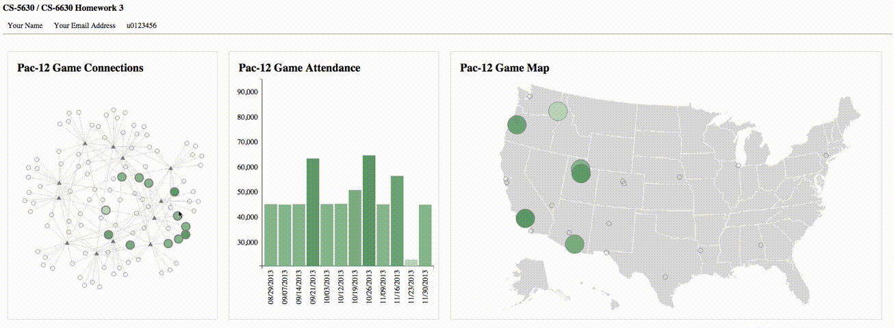

#CS-5630 / CS-6630 Homework 3
*Due: Friday, September 25, 11:59 pm. Value: 6%*

In this assignment you will create a bar chart, a node-link diagram and a map that are linked to each other and visualize data from PAC 12 teams and games.

## Implementation

We have provided boilerplate code that you should pull into your private repository.

As in previous homeworks, add your name, your e-mail address, and your uID to the HTML elements at the top. Also make sure your submission is a valid HTML5 file. Check that it is valid by uploading it to the [W3C HTML Validator](https://validator.w3.org/#validate_by_upload).

Other than adding your name, etc., you shouldn't need to edit hw3.html in this assignment (though you are free to add / adjust CSS rules if you wish).

Your project structure should look like this:

    hw3/
        hw3.html
        script.js
        data/
            pac12_2013.json
            us.json

Remember, to be able to access the data files with javascript, you will need to be *serving* the hw3 directory, not just opening the HTML file in a browser. If your development environment doesn't already launch a server for you, you can start one with:

    cd path/to/hw3
    python -m SimpleHTTPServer 8080

And you can view the page at [http://localhost:8080](http://localhost:8080)

## Visualization design

We are going to compare attendance at Pac-12 (American) [Football games](http://datahub.io/dataset/college-football-statistics-2005-2013) in 2013 (unfortunately, the organization that collects this data stopped releasing it publicly in 2014).

We want to understand football game attendance from the team perspective (how did attendance at a team's games change as the season progressed?), from the geographic perspective (how did geography factor in to game attendance?), and from a network perspective (how did the opposing team factor in to game attendance?).

You will be implementing a bar chart, a node-link diagram with a force-directed layout, and a map view of the data.

In addition to supporting hover events on Teams, Games, and Locations, your tool will support *selecting* sets of Games. The bar chart will display only the selection.

## About the data

We have taken care of the data loading for you in the homework skeleton. We're reading in the graph data from the `pac12_2013.json` file and the map for the `us.json` GeoJSON file. 

The graph data (the global ``data`` variable) contains *two* classes of nodes; Team nodes, and Game nodes. Each Team or Game node has a ``data_type`` attribute that indicates what it is. In addition to this, we have created two lookup tables (``locationData`` and ``teamSchedules``) that contain ordered lists of games for locations and teams.

To better understand the structure of the data or the lookup structures we have provided, it's a good idea to start by logging the data objects to the console.

## Part I: Bar Chart: Scales and Axes

Your first task is to fill in the ``updateBarChart()`` function. Create a bar chart that displays the attendance of each Game object in the ``selectedSeries`` list (the program starts off with all of Utah's games selected).

Make sure to include x and y axes, with date and numeric tick labels, respectively.

Next, color each bar based on the game's attendance (both height and color should encode game attendance); define and use the global ``colorScale`` variable. Make sure to use a perceptually salient color scale; good examples are available at [colorbrewer2.org](http://colorbrewer2.org).

Make sure to use a **consistent** vertical and color scale (this should not change), and adapt the horizontal scale to the number of data points that have been selected.

## Part II: Node-link Diagram

Your next task is to create an interactive node-link diagram. Note that ``deriveGraphData()`` formats the data in a way that is similar to most online examples - feel free to follow examples, but **always cite your sources** in the comments, especially if your implementation is substantially similar. If in doubt, cite it!

Fill in the first and last parts of ``updateForceDirectedGraph()``. At this stage, the Game and Team nodes should use different shapes, you could use triangles for teams and circles for games. The [d3.svg.symbol()](https://github.com/mbostock/d3/wiki/SVG-Shapes#symbol) function will proof helpful for this. You should also use different CSS styles (hint: check out the CSS in ``hw3.html`` for an easy way to differentiate between the two). 
Your graph should be animated and interactive, i.e., you should be able to drag nodes to adjust the layout.

**Extra Credit:** This is a good example of a [*bipartite* graph](https://en.wikipedia.org/wiki/Bipartite_graph). In addition to the force-directed graph, develop a graph layout that takes advantage of this structure. You are free to choose how you represent it, but you should briefly argue for your design. Put your comments in the HTML file. Put the graph in a new view next to the force-directed layout - you'll have to create this yourself. *Warning: this is not an easy feat, make sure to complete the rest of the assignment before attempting this.*

## Part III: Maps

On to the map. Start by filling in ``drawStates()`` to draw the background. The map we have provided in ``us.json`` uses the Albers USA projection - again, if you mimic code that you find online, **make sure you cite it!**

Now that you've drawn the map, draw the circle (or another symbol you chose to represent games) (in the first part of ``updateMap()``) for each location where a football game was played. Note that some locations in the dataset are missing lat/lon coordinates; it's fine to leave these off the map.

The markers on the map should have the same appearance as the markers that represent games in your node-link diagram; use a consistent visual language throughout your visualization.

## Part IV: Events

At this point, you should have three views of data, but only the force-directed graph is interactive.

There are various places throughout ``script.js`` that are flagged with:

    // ******* TODO: PART IV *******

In each of these locations, make the various marks respond to appropriate events. You shouldn't need to write too much code; linking to the three functions ``setHover()``, ``clearHover()``, and ``changeSelection(d)`` should be sufficient.

## Part V: Reacting to Events

Now you should fill in the three functions. For hover events, display an appropriate text label in the ```` element.

For click events, you should modify the global ``selectedSeries`` array. When you click a game, only that game should be in the selectedSeries array. When you click a team, all its games should be in the array.

Next, add code to your node-link diagram that applies the ``colorScale`` to the fill of the selected game nodes, and dramatically increases their size - nodes that are selected should really stand out (something like 2x the size should do the trick). You can use the svg scale transformation to achieve this. Games that aren't selected should revert to their default styling.

Finally, color each location on the map by the *mean* attendance of the selected games that occurred at that location; you should also increase the size of these nodes so that they stand out.

## Grading

Your final solution should look something like this:

Your score on this assignment will be as follows:

15%: Part I: Bar chart shows current selection, with appropriate scales, axes, and coloring 
30%: Part II: Interactive node-link diagram shows distinct team and game nodes, and their connections 
25%: Part III: You show the map, and it shows locations where games were played 
20%: Part IV + V: Hovering over elements displays meaningful information in the corner of the screen, and the selection can be changed from all three views. Selections are appropriately updated, nodes are enlarged. 
10%: Appropriate sources are cited, and visual design is consistent and perceptually accessible 
20%: Part II Extra Credit: We will judge both the quality of the design and the implementation, and we will use a high standard for full credit. 